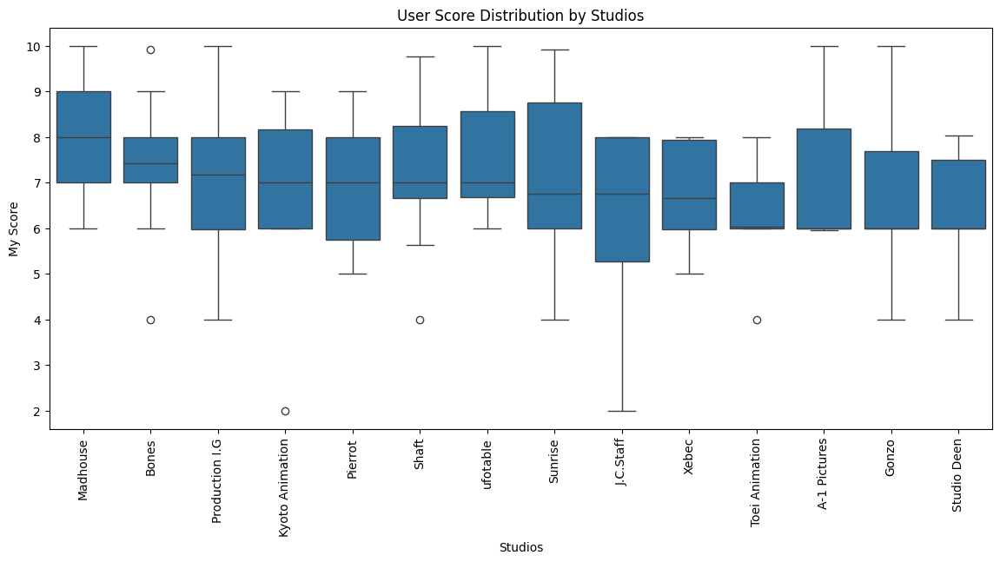
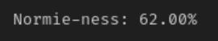
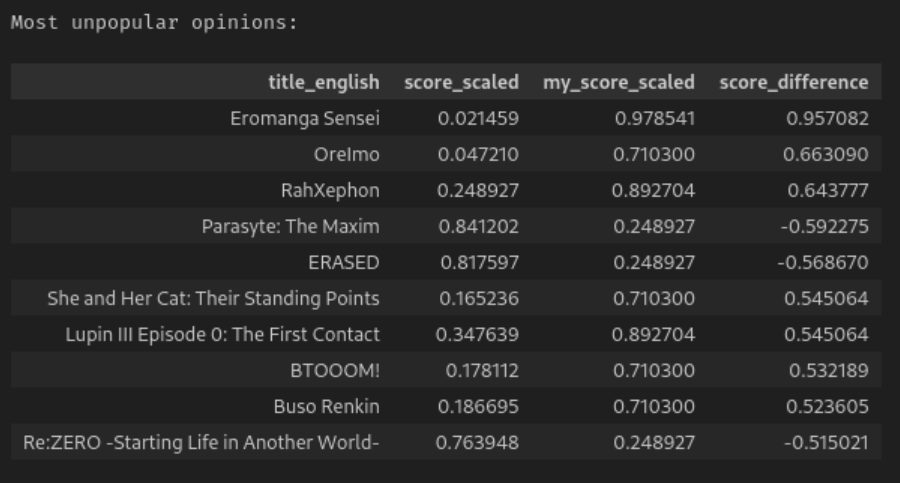

<div align="center">
  
</div>

# MyAnimeStats

Explore insightful statistics about a [MyAnimeList](https://myanimelist.net/) user list.

<!-- Half size -->


## Setup

### Clone the Repository

```sh
git clone https://github.com/titouanlacombe/MyAnimeStats.git
```

### Install the Virtual Python Environment

Using pdm ([install pdm](https://github.com/pdm-project/pdm#installation)):

```sh
pdm sync
```

### Configuration

Before proceeding to the next steps, copy the `.env.example` file to `.env`. You will use this file to configure the project.

### Jikan API

The project can use either the [official Jikan API](https://jikan.moe/) or be self-hosted using Docker.

Using the official Jikan API, you will be limited to 1 request per second (~1 anime per second).

To self-host it, you need to have [Docker](https://docs.docker.com/get-docker/) installed.

#### Using the Official Jikan API

You don't need to do anything; the project will use the official Jikan API by default.

#### Self-hosting Jikan

With Docker installed, in `.env`, change `SELF_HOST_JIKAN` to `true`.

Optionally, you can change the `JIKAN_PORT` variable to the port you wish to use.

Then, run the following command to start the local Jikan API:

```sh
make up
```

Jikan will be available at `http://localhost:{JIKAN_PORT}/v4`. The project will use this URL to make requests.

### Run the Notebook

Run the notebooks in the pipenv environment using the method of your choice (e.g., VSCode, Jupyter).

For example, to run the web server notebook, use the following command:

```sh
make notebook
```

## Usage

The notebook will ask for your MyAnimeList username to scrape your list.

You can save your username in `data/username.txt` to avoid having to enter it every time.

If you want to scrape your list, ensure it is public. You can make your list public [here](https://myanimelist.net/editprofile.php?go=listpreferences).

Alternatively, if you wish to keep your list private, you can export your MyAnimeList data from [here](https://myanimelist.net/panel.php?go=export) and save it to `data/animelist.xml.gz`.

Now, you can run all the cells in the notebook and view the results.

## Results

For example, here are the stats of popular YouTuber [Gigguk](https://www.youtube.com/user/gigguk) (MAL username: `gigguk`):






